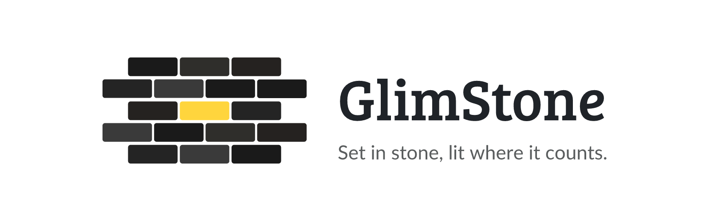

  <picture>
    <source media="(prefers-color-scheme: dark)" srcset=".github/assets/glimstone-banner-dark.png">
    
  </picture>

  

The shared design language behind a family of apps by the same author: a layered, low-noise interface system built on IBM Carbon's neutral palette, with one shared accent, one shared shape engine, and a house style for componentry (cards, tabs, switches, the info bubble, the reveal eye).

  

This repository is the canonical source — the written spec, and the reference token files an adopting app copies from. It has no build step and ships no package; adoption is copy-and-paste by design, so a plain-CSS Unraid plugin and a React/Tailwind app can both read the same design language without sharing a runtime.

GlimStone documents a house style shared across the author's own apps. It's published for reference and transparency rather than as a general-purpose design system for outside adoption — see [`docs/design-language.md`](docs/design-language.md) for the full reasoning and everything else.

 

## Contents

1. [What's in this repo](#1-whats-in-this-repo)
2. [The short version](#2-the-short-version)
3. [Adopting GlimStone in an app](#3-adopting-glimstone-in-an-app)
4. [Where per-app detail lives](#4-where-per-app-detail-lives)
5. [Versioning](#5-versioning)
6. [License](#6-license)
7. [Support this project](#7-support-this-project)

 

## 1. What's in this repo

- [`docs/design-language.md`](docs/design-language.md) — the full spec: the palette, the name and its etymology, all nineteen rules, the componentry vocabulary (info bubble, horizontal selector, switches, the reveal eye, badges, toasts, empty states, destructive actions, charts), the colour and motion engines, the token contract, and the adoption steps. This is the document to read start to finish; everything below just points back into it.
- [`reference/tokens.css`](reference/tokens.css) — the palette and component classes as plain CSS custom properties. No build step, no framework. Copy the parts an app needs.
- [`reference/tailwind-theme.css`](reference/tailwind-theme.css) — the optional Tailwind v4 `@theme` layer that maps the tokens onto utility classes. Skip it entirely on a non-Tailwind app.
- [`reference/appearance.ts`](reference/appearance.ts) — the shape/accent/rainbow logic. Framework-free (talks only to `document.documentElement` and `localStorage`), so it drops into any app unchanged.
- [`reference/controls.ts`](reference/controls.ts) — the label engine: four modes (text, text+glyph, glyph, reactive) across three independent surfaces, plus the width stages that let a mode change happen without the page reflowing. Framework-free the same way.
- [`reference/glyphs.md`](reference/glyphs.md) — the shared glyph assortment: which icon means what, where each comes from and under which licence, and the sizing rules that make a set of icons read as one set.
- [`CHANGELOG.md`](CHANGELOG.md) — what changed in the language itself, versioned.

 

## 2. The short version

IBM Carbon's neutral greys for the ground and surfaces, one accent that means "this is happening" and nothing else, four state hues total, hierarchy from type and colour rather than borders, and every heading rendered as a filled section badge rather than bare text. The two settings a user actually owns — corner shape and accent colour — are applied once at the app root and never touched by the page underneath them. See [`docs/design-language.md`](docs/design-language.md) for the palette table and all nineteen rules with their reasoning.

 

## 3. Adopting GlimStone in an app

1. Copy the `:root` / `[data-theme="light"]` blocks from [`reference/tokens.css`](reference/tokens.css) into the app's stylesheet.
2. Copy `.glim-card` / `.glim-well` / `.glim-eyebrow` / `.glim-num`, plus the base `body`/font rules and the scrollbar and focus rules, from the same file.
3. Add whatever tokens the app doesn't have yet — the full list is in the file's own comments and in the design-language doc's token table.
4. Replace hard-coded `rounded-lg` / `shadow-*` with `.glim-card`; fill the selected nav item, tab or segment with the accent.
5. For rainbow, copy [`reference/appearance.ts`](reference/appearance.ts) as-is.

Nothing else is required — component markup stays as it is, because every colour already flows through a token. Full detail (including the three traps that have bitten every adopter so far) is in [`docs/design-language.md`](docs/design-language.md#adopting-glimstone-in-another-app).

 

## 4. Where per-app detail lives

This repository is deliberately app-agnostic. Anything true for only one app — its exact token names if they diverge from the reference, class prefixes, measured pixel values, quirks of a specific host UI it runs inside — belongs in that app's own style guide, not here. If the same rule shows up in both places, it gets deleted from the app-specific one: universal belongs here, an exception belongs there.

 

## 5. Versioning

GlimStone the language is versioned independently of any app that adopts it — a rule added here doesn't imply every adopting app has picked it up yet. See [`CHANGELOG.md`](CHANGELOG.md) for what changed and when.

 

## 6. License

**Copyright (C) 2026 Junker der Provinz.**

GlimStone is free software under the **GNU Affero General Public License v3.0** (AGPL-3.0); see [LICENSE](LICENSE). You may run, study, share and modify it. If you distribute it, or run a modified version as a network service, you must release your source under the same AGPL-3.0 terms and keep the existing copyright and attribution notices intact.

**Name and branding are not licensed.** The AGPL covers the source and documentation only. "GlimStone", its logo and its branding remain reserved: a fork or derivative must use its own distinct name and branding, and may not present itself as GlimStone. This keeps it unambiguous which project is the original.

 

## 7. Support this project

Bugs, ideas or questions? Please [open a GitHub issue](https://github.com/junkerderprovinz/glimstone/issues).

This is a one-person project, maintained in whatever free time is available. If it's been useful as a reference, you're welcome to buy me a coffee.

  

